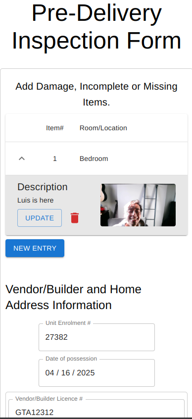

# Inspection Form

A React-based Progressive Web App (PWA) for conducting home inspections, designed to streamline the pre-delivery inspection process.



## Features

- 📸 Take and attach photos of inspection items
- ✍️ Capture digital signatures from all parties
- 📝 Record inspection details and comments
- 📱 Works offline (PWA)
- 📄 Generate PDF reports

## Tech Stack

- React 18
- Material-UI
- Redux Toolkit
- PWA capabilities
- jsPDF for PDF generation
- react-signature-canvas
- react-html5-camera-photo

## Development

### Prerequisites

- Node.js 16+
- npm or yarn

### Local Setup

```bash
npm install
npm start
```

### Docker Setup

```bash
docker build -t inspection-form .

docker run -p 3000:3000 --name inspection-app -v "$(pwd):/app" -v /app/node_modules inspection-form
```


## License

MIT
---


The app is designed to be mobile-friendly and can work offline thanks to service worker implementation. For the best experience, use a modern browser with camera access enabled.